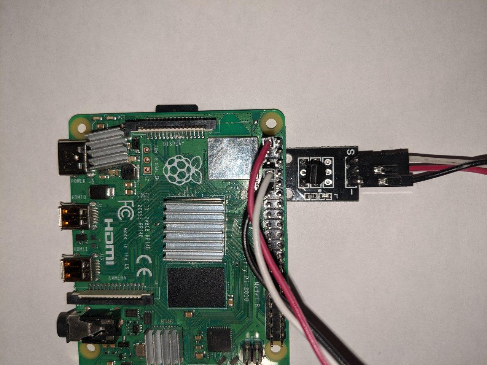
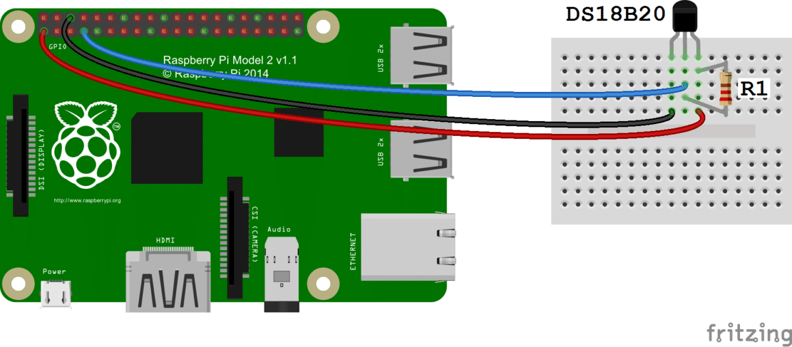

Temperature Sensor Demo
-----------------------

The most of the following instructions are provided by [@PavelSheremetev](https://github.com/pavelsheremetev)

# Burn an image to an SD card
## 1 Download the latest image of Aira for Raspberry Pi 4

https://aira.life/channels/aira-unstable/

## 2 Write the image to a SD card

```
sudo dd if=/path/to/image of=/path/to/sdcard bs=4M status=progress
```

Example for Linux:

```
sudo dd if=aira-image-rpi4-20.03pre-git-aarch64-linux.img of=/dev/sda bs=4M status=progress
```

Example for MacOS:

```
sudo dd if=aira-image-rpi4-20.03pre-git-aarch64-linux.img of=/dev/disk2s1 bs=4m status=progress
```

## 3 Make sure everything is written:

```
sync
```

# Next steps are done on the Raspberry Pi
## 4 Boot with SD card and wait until you see:

```
    <<< Welcome to NixOS 20.03pre-git (aarch64) - ttyS0 >>>  
  
  
    aira-rpi4 login: root (automatic login)  
  
    Starting...  
    
        _    ___ ____      _      
       / \  |_ _|  _ \    / \   
      / _ \  | || |_) |  / _ \  
     / ___ \ | ||  _ <  / ___ \ 
    /_/   \_\___|_| \_\/_/   \_\
                            

    My Ethereum address is "38411681740ca6214b448d49549bb1dfd0a0cffa"  
  
    Look me at https://status.robonomics.network by "Qmdiiux3uQS8JyuPNa7Vj3iNe7UZBrpMPB2dEqUeo4YRGH"
```

# Connect to network

## 5.1 LAN
See #6

## 5.2 WiFi

By default the board connects to `Aira` with a password `airapassword`.
To add another WiFi network do the following:

```
wpa_supplicant -B -i wlan0 -c <(wpa_passphrase 'SSID' 'key')
```

where `'SSID'` - the name of WiFi network and `'key'`- the password

Uncomment and edit the following lines in the file `/etc/nixos/configuration.nix`:

```
SSID = { psk = "password"; };
```

where `SSID` - the name of the WiFi network and `'password'`- the password

# Starting configuration  
## 6 Switch to unstable channel and update channel cache

To connect to the unstable repository channel, do the following:

```
nix-channel --remove nixos
nix-channel --add https://aira.life/channels/aira-unstable/ nixos
```

to view a list of connected channels: 

```
nix-channel --list
```

channel cache update:

```
nix-channel --update
```

## 7 OS configuration update and first reboot
To apply the changes you must complete:

```
nixos-rebuild switch  
```

The first reboot must be done using `reboot` command.

## 8 Adding ssh rsa key from github.com
To add ssh rsa key from github.com do the following commands:

```
mkdir /root/.ssh
chmod 700 /root/.ssh
curl https://github.com/your-username.keys -o  /root/.ssh/authorized_keys
chmod 600 .ssh/authorized_keys
```

`your-username` need to be replaced with your github username. After that, you can connect to Raspberry Pi via ssh

## 9 Temperature sensor connection

In `/etc/nixos/configuration.nix` file on your Raspberry Pi have uncomment the following lines by using `nano` command:

```
boot = {  
    initrd.kernelModules =  [ "w1-gpio" "w1-therm" ];  
};  
hardware = {  
    deviceTree  = {  
        enable = true;  
        base = "${pkgs.linux_rpi4}/dtbs" ;  
        overlays = ["${pkgs.linux_rpi4}/dtbs/overlays/w1-gpio.dtbo"];  
    };
};
```
And then do:
```
nixos-rebuild switch 
```

After that switch off you Raspberry Pi by doing the following command and diconnect the power:

```
shutdown -h now 
```
Connect the sensor

### Connecting a Sensor from the Sensor Kit for Arduino - TEMP 18B20  



### Sensor connection - ds18b20



We connect the power and after RPi boots up we need to check the correctness of the connection:

```
ls /sys/bus/w1/devices/
```

this directory should not be empty:

```
root@aira-rpi4> ls /sys/bus/w1/devices/                                       ~
28-01162784ddee  w1_bus_master1
```

## 10 Building and launching the agent

### Build

Clone the repository and build the package

```
git clone https://github.com/Vourhey/temperature_sensor_demo
cd temperature_sensor_demo
nix build -f release.nix
```

### Launch

```
soure result/setup.zsh
roslaunch temperature_sensor_demo worker.launch account:=<YOUR_ETH_ACCOUNT> [no_sensor:=true] 
```

where `<YOUR_ETH_ACCOUNT>` is an account you send a demand message from. To find out the address go to the [Dapp](https://ipfs.ipci.io/ipfs/QmZp1hMMLnfr3g2Liqg3wFqiRQ1fGDtwa7CDPxxDzHvZWo/#/)

> [MetaMask](https://metamask.io/) extension is required

`no_sensor` - is for debug purpose

